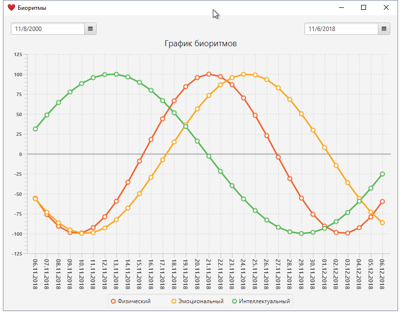

# Калькулятор Биоритмов

## Описание
Вычисление и построение графика трех биоритмов (см. [теория «трёх ритмов»](https://ru.wikipedia.org/wiki/Биоритм#Теория_«трёх_ритмов»)) на месяц вперед.

## Скачать
[1.0.0](https://github.com/dev-gvs/biorhytms/releases/tag/1.0.0) - актуальная версия.
